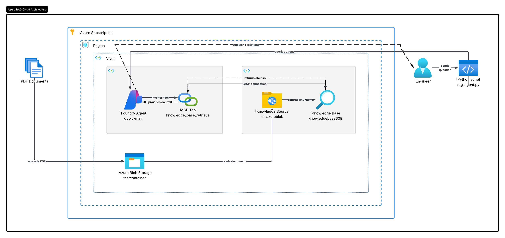

# Foundry IQ Support Assistant

## Overview

This project is a Retrieval-Augmented Generation (RAG) assistant built on Microsoft Foundry, using Foundry IQ for knowledge retrieval. It answers questions about internal engineering documentation — onboarding, incident response, security policy, and coding standards — by grounding responses in a set of source documents rather than relying on a model's general knowledge.

It includes:

* A knowledge base built from multiple source documents, indexed and made searchable via Azure AI Search (Foundry IQ).
* A custom Foundry agent equipped with an MCP-based retrieval tool, connected to that knowledge base.
* Routing logic (via both knowledge base retrieval instructions and agent instructions) to prioritize the correct document when a question could plausibly relate to more than one source.
* Transparent citation of sources for every answer, so responses can be traced back to the exact document they were grounded in.

## Architectural Diagram



## Why RAG?

Language models can answer general questions confidently, but they have no knowledge of an organisation's specific policies or documentation. This project demonstrates how retrieval-augmented generation grounds a model's responses in real, current source documents — reducing hallucination and enabling accurate answers to organistion-specific questions.

## Local Setup

```bash
python3.13 -m venv .venv
source .venv/bin/activate
pip install -r requirements.txt
```

Create a `.env` file with the following variables (see `.env.example`):

```
PROJECT_ENDPOINT=
PROJECT_RESOURCE_ID=
PROJECT_CONNECTION_NAME=
MCP_ENDPOINT=
```

## Repository Structure
 
```
support-assistant-rag
├── .env.example
├── .gitignore
├── README.md
├── requirements.txt
├── setup_infrastructure.py
├── rag_agent.py
├── documents/
│   ├── onboarding_guide.pdf
│   ├── incident_response_runbook.pdf
│   ├── security_access_policy.pdf
│   └── coding_style_guide.pdf
└── images/
    └── architecture-diagram.png
```
## Key Components
 
### Documents
 
Four synthetic documents representing common internal engineering resources, deliberately overlapping in places (for example, pull request expectations appear in both the onboarding guide and the coding style guide) to test the assistant's ability to correctly prioritise or combine sources.

### Foundry IQ Knowledge Base
 
- **Knowledge source** — connected to an Azure Blob Storage container holding the four source documents.
- **Knowledge base** — wraps the knowledge source, with custom retrieval instructions to prioritise specific documents based on question topic.
- **Azure AI Search** — handles chunking, embedding, and semantic retrieval under the hood.

### Foundry Agent
 
- **Model** — gpt-5-mini, generating the final grounded answer.
- **MCP Tool** — `knowledge_base_retrieve`, connected to the knowledge base via a project-level connection using managed identity.
- **Instructions** — define when to use the tool, how to prioritise between documents and require explicit source citation.

## Setup Workflow
 
Infrastructure setup (the connection and agent) is a one-time step, separated from day-to-day querying:
 
1. **`setup_infrastructure.py`** — creates the project connection to the knowledge base and defines the agent. Run once, or re-run to update the agent's instructions or tools.
2. **`rag_agent.py`** — sends a question to the existing agent and prints the answer along with cited sources.


```bash
python setup_infrastructure.py
python rag_agent.py
```


## Example Output
 
```
Q: What's the maximum time before a Severity 1 incident needs to be escalated?
 
Initial escalation: 30 minutes (escalate to the secondary on-call).
Further escalation: 60 minutes (Incident Commander convenes war room and notifies Head of Engineering).
 
Sources:
- Incident Response Runbook
```

```
Q: Do I need to use an authenticator app for two-factor authentication, or can I use text messages?

Short checklist — what we expect when you open a PR:

- Use the correct branch name (feature/short-description or fix/short-description).【6:0†API and Coding Style Guide】  
- Scope the PR to a single logical change; don’t bundle unrelated fixes.【6:0†API and Coding Style Guide】  
- Include a clear description of what changed and why, and link the relevant ticket.【6:0†API and Coding Style Guide】  
- Add tests: new code needs unit test coverage (≥80% for new code); critical paths also need integration tests. Tests must pass in CI before merge.【6:0†API and Coding Style Guide】  
- Ensure public API changes are documented (OpenAPI) and internal libraries have README updates as needed.【6:0†API and Coding Style Guide】  
- At least one approval is required before merging; reviewers are expected to respond within one business day.【6:0†API and Coding Style Guide】【6:1†New Engineer Onboarding Guide】  
- Squash commits on merge to keep main branch history clean.【6:0†API and Coding Style Guide】

If you want, paste the PR link and I’ll run through this checklist for you.

Sources:
- Coding Style Guide
- Onboarding Guide

```

```
Q: What are the requirements for API endpoint naming?

Requirements for API endpoint naming:

- Use plural nouns for resources (e.g., orders, customers).  
- Use kebab-case for paths (hyphen-separated), e.g. /api/customer-orders.  
- Avoid verbs in endpoint paths; use HTTP methods to express actions (GET, POST, PATCH, DELETE).  
- Public API endpoints must be documented using the OpenAPI specification.

Source: API and Coding Style Guide【6:0†source】

Sources:
- Coding Style Guide

```

